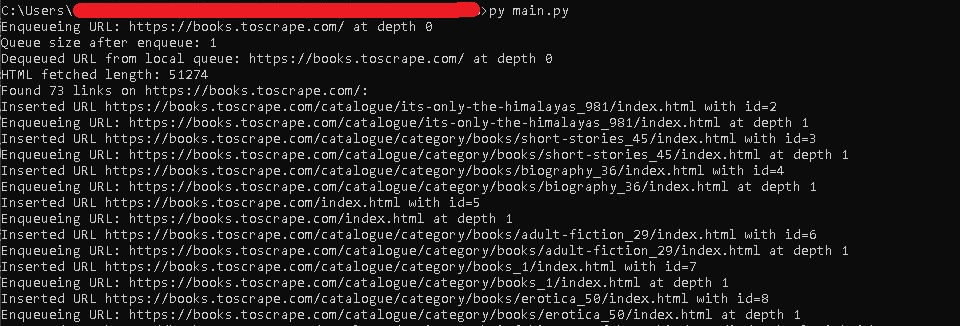
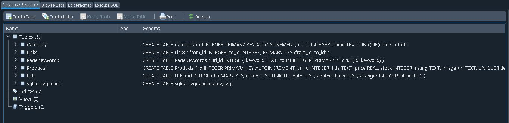
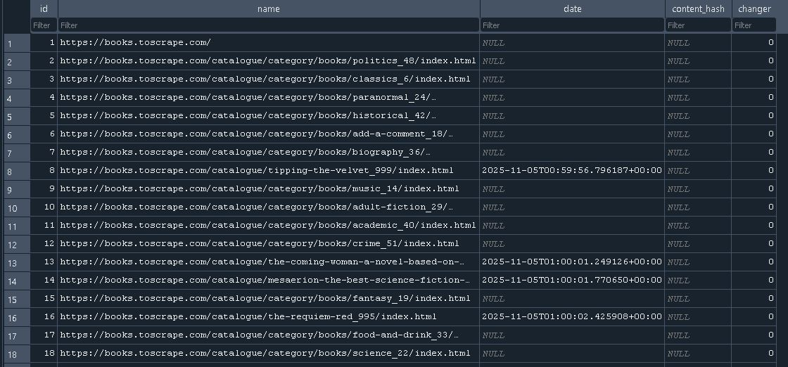
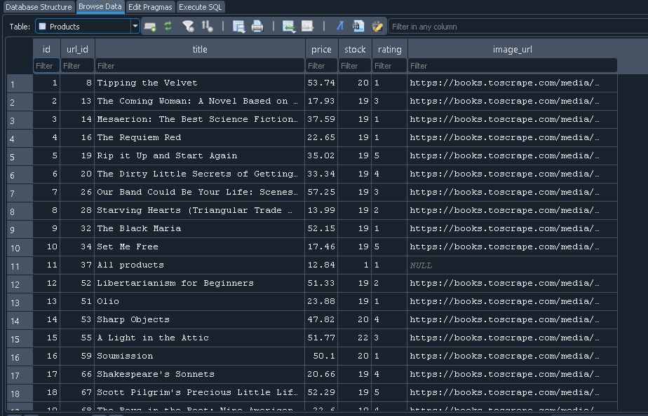
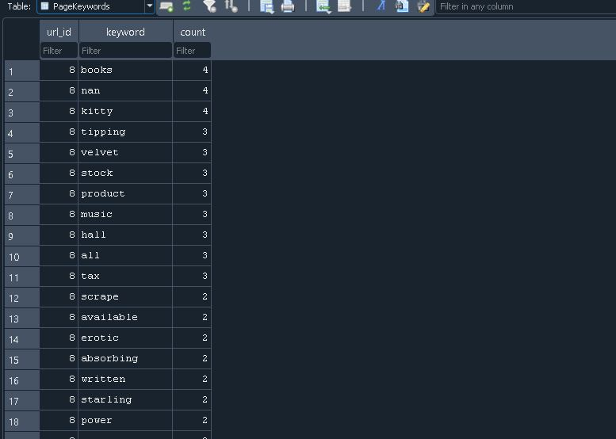
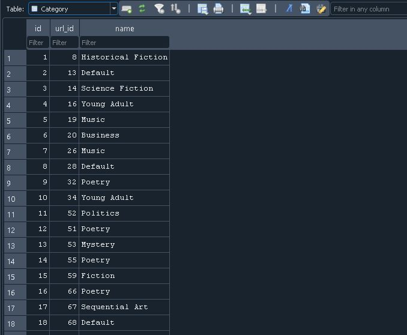
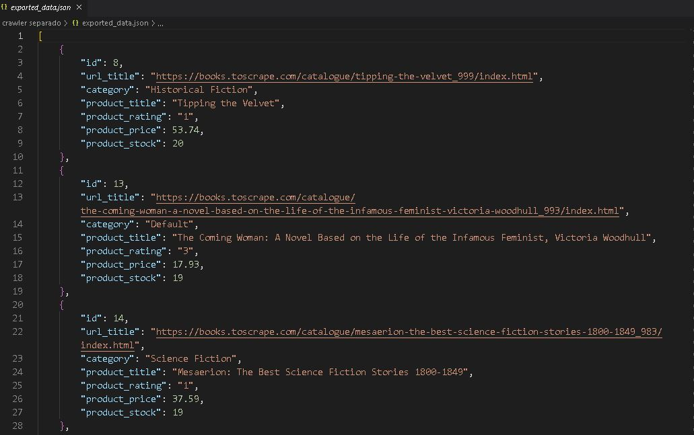
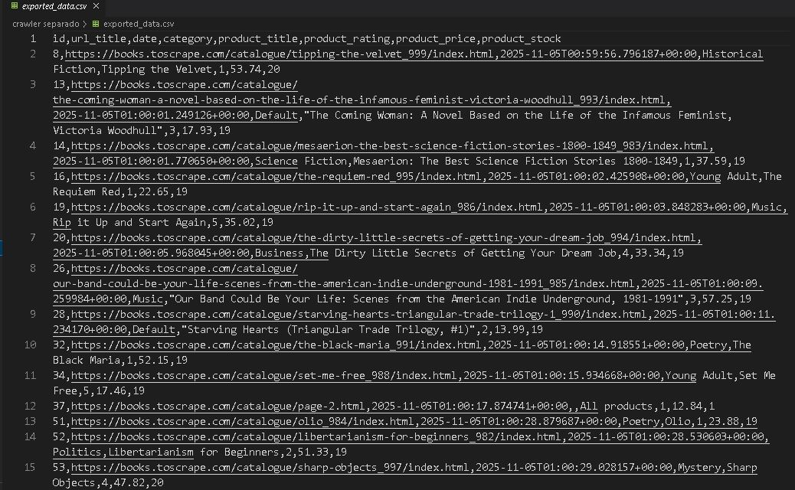

# Async Web Crawler

An **asynchronous web crawler** built with Python and aiohttp.
The crawler stores results in SQLite by default and can also export to JSON or CSV. It fetches pages asynchronously, stores URLs, categories, and keywords, and optionally scrapes product data. In addition, the crawler respects robots.txt, avoids duplicate requests, and can resume unfinished crawls.

Note: as a personal project, some sections are **designed for https://books.toscrape.com**. Adapting to other sites would require minor changes.

💻 Example output: mini.sqlite database with URLs, categories, keywords, and product details like title, price, stock, and rating.


---

## Features

- **Asynchronous crawling** with `aiohttp` and `asyncio`
- **Configurable crawl depth, rate limits, and file type filters** via `config.json` and CLI flags
- **Robots.txt** compliance (via RobotFileParser).
- **SQLite database** with tables for URLs, links, categories, keywords, and products
- **Resume crawling** from unfinished URLs
- **Keyword extraction** with **stopword filtering**
- **Product page scraper** (example: books catalogue)
- **Export results** to SQLite, JSON, or CSV
- **Handles redirects, errors, and SSL issues**
-- **Logs skipped URLs and reasons**

---

## Requirements

- Python 3.9+

- Install dependencies:

    ```pip install aiohttp beautifulsoup4```


---

## Configuration

- Crawler settings are stored in a config.json file. Example:

```json
{
  "seed_url": "https://books.toscrape.com",
  "delay_min": 1,
  "delay_max": 3,
  "batch_size": 2,
  "file_type_filters": [".jpg", ".png", ".gif", ".pdf"],
  "crawl_depth_limit": 10,
  "output_format": "sqlite",
  "max_concurrent_per_domain": 2,
  "include_paths": [],
  "exclude_patterns": ["\\.pdf$", "\\.jpg$", "/private/.*"],
  "min_content_length": 100,
  "max_content_length": 100000,
  "user_agent": "MyCrawlerBot/1.0"
}

```

• seed_url: starting URL for the crawl

• delay_min / delay_max: min/max delay between requests to the same domain

• max_concurrent_per_domain: number of simultaneous requests per domain

• file_type_filters: ignored file extensions

• crawl_depth_limit: how deep to follow links

• exclude_patterns: regex patterns to skip URLs

• min_content_length / max_content_length: content size validation


---

## Usage

- The program is optionally CLI configurable. 
- Example:

```python crawler.py --domain https://books.toscrape.com/ --depth 2```

### CLI Options:

- `--domain` : Override seed URL from config  
- `--depth` : Set crawl depth limit  
- `--resume` : Resume crawling from unfinished URLs

## Example for standard terminal output


*Shows the crawler running from the command line with asynchronous workers fetching pages, enqueuing new URLs and respecting rate limits*

---    

## Database schema

- Urls: crawled URLs, timestamps, content hash

- Links: relationships between pages

- Category: extracted categories

- PageKeywords: keywords and counts

- Products: scraped product data (title, price, stock, rating, image)


## Example: DB structure



*Shows the structure of the SQLite database, including the Urls, Links, Category, PageKeywords, and Products tables created and updated during crawling.*

## Example: URLs table



*This is how the crawler stores the URLS. In this particular crawl, I made sure to skip pages which did not match a "product page" HTML layout.*

## Example: Products table



*Shows the category table generated from the website’s structure, including the normalized category names extracted from navigation menus.*

## Example: Keywords table



*Displays the PageKeywords table containing tokens extracted from page text, along with frequency counts and stopword filtering applied.*

## Example: Categories table



*Shows the category table generated from the website’s structure, including the normalized category names extracted from navigation menus.*

---

## Export

- sqlite (default): Results stored in `mini.sqlite`

- JSON / CSV: The crawler stores results in mini.sqlite by default. To export to JSON or CSV, run a crawl, store to sql and then run:

   For JSON: run `python main.py --export json`
   For CSV: run `python main.py --export json`


## Examples: JSON export file



*Shows a snippet of the JSON file produced using --export json, containing structured data for URLs, keywords, categories, and products.*

## Examples: CSV export file



*Shows the CSV format produced using --export csv, where crawled data is stored in tabular form for spreadsheets or external tools.*

---

## Logs

- crawler.log: general activity

- crawler_errors.log: errors during crawling

- skipped_pages.log: skipped URLs with reasons

---

## Quick Start

1. Install dependencies: `pip install aiohttp beautifulsoup4`
2. Configure `config.json` (domain, depth, batch size)
3. Run the crawler (results stored in mini.sqlite by default): `python main.py`
4. Export results to JSON (or CSV) (optional):
   For JSON: run `python main.py --export json`
   For CSV: run `python main.py --export json`

--


## Project structure

```
project_root/
│
├── crawler.py # Main async crawler logic (queue, workers, enqueuing, fetching)
├── db.py # Database utilities (insert URLs, products, links, categories, keywords)
├── parse.py # Parsing and processing functions (extract links, keywords, categories)
├── fetch_utility.py # Functions to fetch URLs, handle JS pages, check content
├── export.py # Export database results to JSON or CSV
├── config.json # Configuration file (seed URL, depth, delays, filters)
├── crawler.log # General activity logs
├── crawler_errors.log # Errors during crawling
├── skipped_pages.log # Skipped URLs with reasons
├── requirements.txt # Optional, list of pip dependencies
└── README.md # Project documentation
```

---

## License

This project is licensed under the MIT License – see the LICENSE file for details.

---

## Contributions & Issues

Feel free to open issues or pull requests!
For major changes, please open an issue first to discuss.

---

## Acknowledgements

- Uses aiohttp library and BeatifulSoup.


